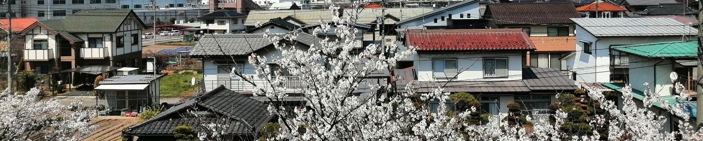

# 屋代PC同好会結成会のWebサイトにようこそ

## 結成会とは？
屋代高校にPC同好会を作ろうとしている人たちのあつまりです！  

[-> もっと詳しく! <-](About/intro){: .md-button }

## どんなことをするの？
現在はメンバーがそれぞれの活動を報告したり、相談したりしています。  
競技プログラミングのコンテストに参加していたりもします。

## 活動の記録
|||
|---|---|
|パソコン甲子園への出場|[PCKについて :fa-external-link:](http://web-ext.u-aizu.ac.jp/pc-concours/){: .md-button }|
|記事の執筆|[詳しくみる](Articles/project){: .md-button }|
もっとたくさんあります！

## Twitterの投稿
<a class="twitter-timeline" data-width="320" data-height="400" data-theme="dark" href="https://twitter.com/YashiroPCClub?ref_src=twsrc%5Etfw">Tweets by YashiroPCClub</a> 

## SNS
||||
|---|---|---|
|[ :fa-twitter: ](https://twitter.com/yashiropcclub){: .md-button .md-button--primary } |[ :fa-github: ](https://github.com/ypcc-org){: .md-button .md-button--primary } |[ :fa-instagram: ](https://www.instagram.com/ypcc_org/){: .md-button .md-button--primary }
